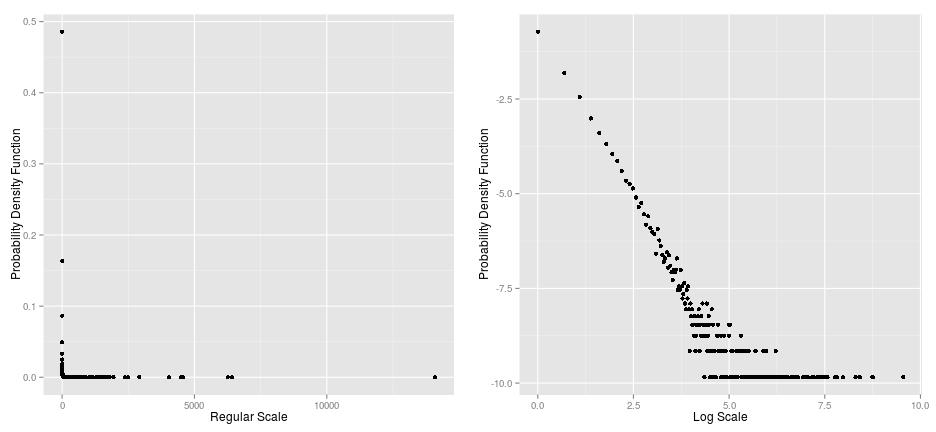
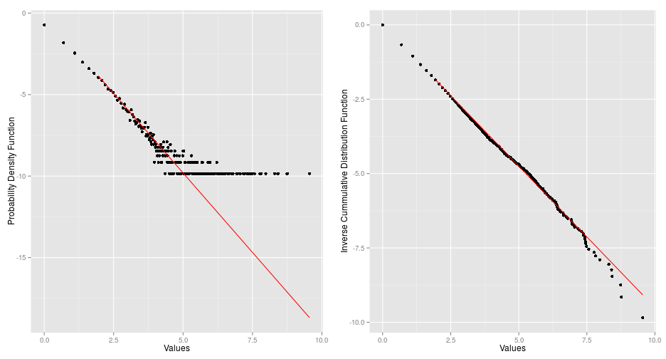

## Power Laws: Grabbing the Dragon by the Tail
#### Raymond
Practitioner of the Dark Data Arts

---

## Introduction

1. Many distributions in "Nature" follow power law distribution, e.g. the Internet, city sizes, etc

2. Our web app displays the distribution of word frequencies of the novel Moby Dick

3. This empirical distribution is best described by a power law which we fit with our model

---

## Power law distribution in log scale
Empirical power law distributions have fat tails hence logging both axes of the probability density functions is appropriate

---

## Modelling the power law distribution

1. In empirical distributions, the power law only applies to the tail of the distribution

2. The start point of the power law is refered to as $x_{min}$

3. The power law has the form $$f(x) \propto x^{-\alpha}$$where $x$ is the value, $f(x)$ is the frequency of $x$ and $\alpha$ is the power law exponential

---

## Model fitted to the power law distribution

The inverse cummulative distribution function of an empirical power law is straight line

